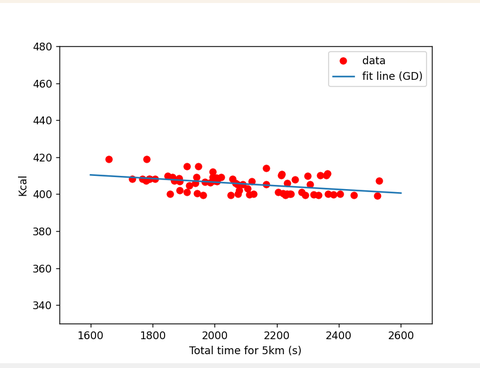
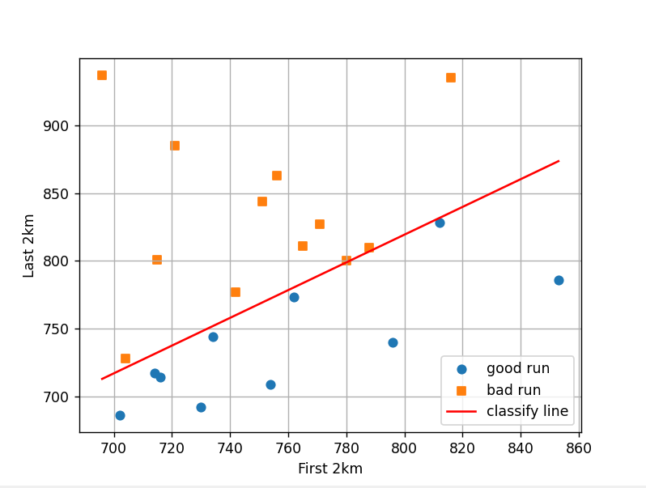
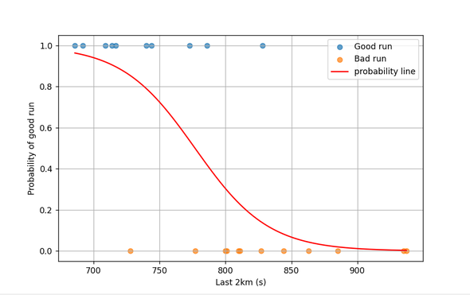
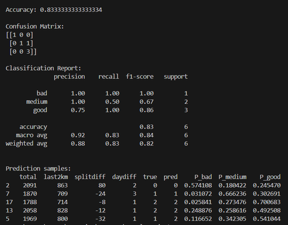
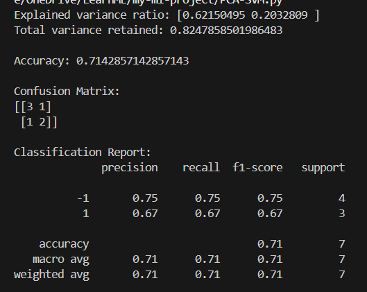

## Table of Contents

1. [Introduction](#introduction)
2. [Dataset](#dataset)
3. [Output](#outcome)

---

## Introduction 

- A project analyzing my 5km runs.
- The aim of this project is to develop an understanding of machine learning algorithms.

---

## Dataset 

- The dataset consists of my running data collected from March 2025 to February 1, 2026.
- Runs data recorded by [Strava](https://www.strava.com/)  
  (you can follow my [Strava account](https://www.strava.com/athletes/162589028)).

- **Significance of the features:**
  - **km1 – km5**: running time per kilometer.
  - **kcal**: calories burned.
  - **total**: total running time for 5 kilometers.
  - **day**: date of the run.
  - **daydiff**: elapsed time relative to the previous run.

- **Example dataset:**

| km1 | km2 | km3 | km4 | km5 | total | kcal | day        | daydiff |
| --: | --: | --: | --: | --: | ----: | ---: | ---------- | ------: |
| 6.5 | 6.4 | 6.6 | 6.7 | 6.5 |  32.7 |  320 | 2024-07-01 |       2 |
| 5.8 | 5.9 | 6.0 | 6.1 | 6.0 |  29.8 |  410 | 2024-07-04 |       3 |
| 7.2 | 7.3 | 7.1 | 7.4 | 7.2 |  36.2 |  280 | 2024-07-05 |       1 |

---

## Output 

### 1. Linear Regression

- Estimate the linear relationship between running time and calories burned.
- Apply **Normal Equation** and **Gradient Descent**.

  

---

### 2. Perceptron Learning Algorithm

- Classify **good** and **bad** running sessions.

  

---

### 3. Logistic Regression

- Predict the probability of a **good running session** based on the **last 2 km**.

  

---

### 4. Principal Component Analysis (PCA) with Support Vector Machine (SVM)

- Classify running sessions using:
  - total time
  - last 2 km
  - split difference
  - day difference

  

---

### 4. Gaussian Naive Bayes

- Classify running sessions using:
  - total time
  - last 2 km
  - day difference

  

---

### 5. Principal Component Analysis (PCA) with Support Vector Machine (SVM)

- PCA reduces the original running features into two principal components to remove correlation and simplify the data.

- SVM uses the PCA-transformed data to learn a clear decision boundary between good and bad 5km running sessions.

  

